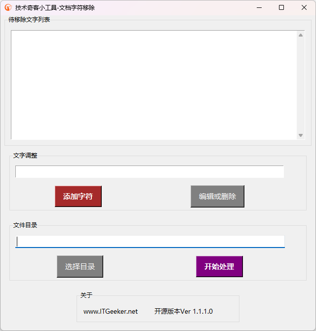

# 移除Office Word文件的指定字符小工具 - 开源Word文字移除

#### 介绍
技术奇客出品的Office系列小工具 - 移除Office Word文件的指定字符。

    - 可指定目录，软件会处理该目录的所有docx文件
    - 可进行批量处理。
    - 已处理文件带有-revised字样，保存在子目录《已处理文件》中。

此工具只支持新版docx文件，若有doc文件，建议使用技术奇客开发的开源工具 - [Word格式转换(.doc ➡ .docx) [点击下载并安装]](https://www.itgeeker.net/itgeeker-technical-service/itgeeker_convert_doc_to_docx/)

技术奇客是奇客罗方智能科技的关联公司。更多信息可访问 ITGeeker技术奇客官方博客 [www.itgeeker.net](https://www.itgeeker.net) 或者 GeekerCloud奇客罗方智能科技 [https://www.geekercloud.com](https://www.geekercloud.com)

>工具运行主界面

#### 软件架构
软件采用Python 3.11版本结合TKinter UI开发，可以运行于Windows 10/11。软件基于Office Word软件对.docx格式文件进行处理，前提必须安装Word软件。
理论上软件也可以运行于Linux系统，但需要依赖LibreOffice。 Linux系统运行功能正在开发中。

    - Windows系统请下载发行版的exe可执行文件即可。
    - Linux理论上只要是Python 3的环境都可直接运行。

#### 运行及使用说明

> Windows版本

    1.  下载可执行文件
    2.  双击文件并执行
    3.  添加想要移除的文本列表
    4.  选择要处理的文档所在的目录
    5.  开始处理

> Linux版本

    1.  确定你又安装Python 3版本，最好3.8以上版本
    2.  安装Python依赖："pip install python-docx tkinter"
    3.  下载本项目到本地目录，并运行："python remove_str_from_word_main.py"

处理过的文件将被保存到子目录“已处理文件”当中，文件名末尾附上“-revised”字样以示区别。

#### 更新日志

> 2023-06-19 v1.1.2.0
 
    1. 更新介绍，增加工具运行界面截图
    2. 修复因为没有移除文字引起的不能保存当前配置的错误
    3. 增加目录文件信息显示docx文件数和doc文件数
    4. 移除自动转换doc为docx功能，提醒软件只支持docx文件格式处理，建议使用技术奇客的开源工具 - 转换Word旧版doc为新版docx

> 2023-06-12 v1.1.1.0
 
    1. icon采用base64代码，便于打包不出错
    2. 文字列表条目较多时显示滚动条
    3. 重构frame，调整视图显示，增加版本等信息
    4. 更改读写文件为json格式，增加目录记忆功能
    5. 增加处理任务完成后弹窗提醒处理的文件数量

> 2023-06-09 v1.0.1.0
 
    1. 调整替换算法，让替换忽略大小写并且更加准确
    2. 如果是doc文件，先转换为docx文件; 转换前检查之前是否已转换
    3. Word文件跳过处理office产生的临时文件（~$*.*）
    4. 文件获取不包含子目录，只处理当前根目录的文件
    5. 添加需处理的字符时，自动去除前后空格
    6. 修复文件名处理时的包含了扩展名错误
    7. 修复首次运行没有默认字符的错误，若把之前的staff_mobile_email.txt放到文件的同一目录，则会自动导入
    8. 任务成功与否都会弹窗提醒

> 2023-06-08 v1.0.0.0
 
    1. 文本列表可自动保存，并在启动时自动加载
    2. 运行移除后将在文件目录创建“已处理文件”子目录
    3. 已处理文件名附件“-Revised”字样，以示区别

#### 参与贡献

    1.  Fork 本仓库
    2.  新建 Feat_xxx 分支
    3.  提交代码
    4.  新建 Pull Request

#### 其他

    1.  阅读README.en.md可以查看英文指导
    2.  ITGeeker 官方博客 [www.itgeeker.net](https://www.itgeeker.net)
    3.  Gitee开源项目地址 [https://gitee.com/itgeeker/itgeeker_remove_str_from_word](https://gitee.com/itgeeker/itgeeker_remove_str_from_word) 
    4.  Github开源项目地址 [https://github.com/alanljj/itgeeker_remove_str_from_word](https://github.com/alanljj/itgeeker_remove_str_from_word) 
    5.  GeekerCloud奇客罗方智能科技 [https://www.geekercloud.com](https://www.geekercloud.com)
